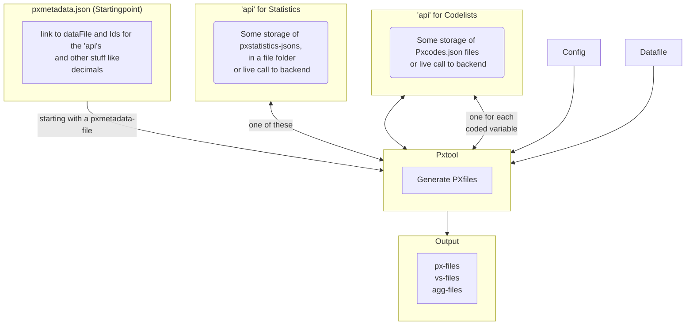

# brand new disclaimer
As the Px family has a new organsation called pxtools, the name of this thing "pxtool" need to change, but to what?   

# disclaimer
This is WORK IN PROGRESS and is be no means ready for production.
# pxtool
Purpose: Creating px-files (.px, .vs and .agg -files), which is one of the datasource-types for the awesome PxWeb ( see https://github.com/statisticssweden/PxWeb ) 

The basic idea: the information needed to be a table in PxWeb is split in 5 parts: 
- config, which is common to all tables for an organisation, e.g. organisation name
- zero or more codelists, for coded variables , often shared by other tables.  
- stuff like subject-area and possible dates of publication. CMS/publication-prosess type of info. The tables typically share these properties with their sibling tables.
- the rest of the metadata, table specific information, e.g. title
- the datadata, a parquet-file (or for testing csv) with the data and implisitt the codelist for time.    

Each part, except the datadata, has a json-schema, named: pxtoolconfig, pxcodes, pxstatistics and pxmetadata.

So, you supply data and the jsons and pxtool generates the px-files.

