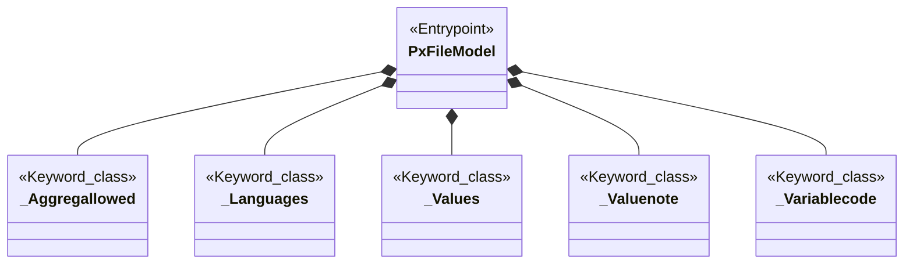
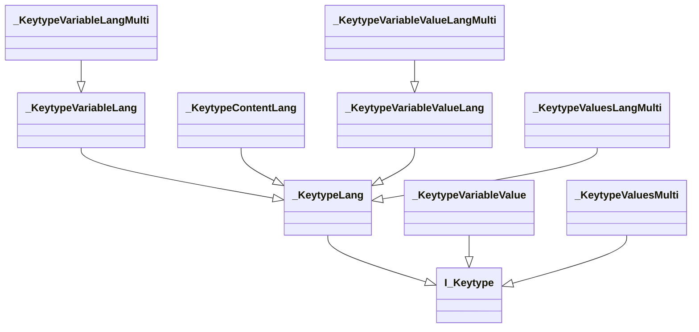
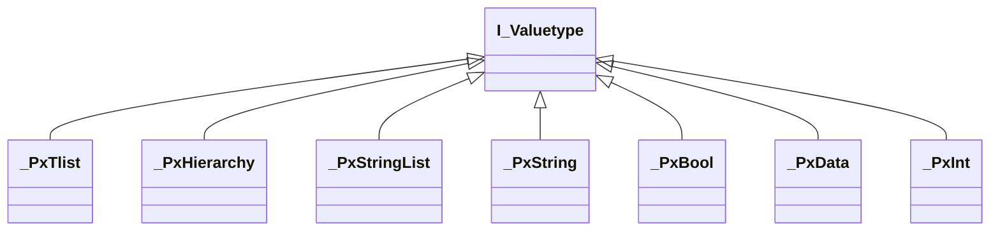
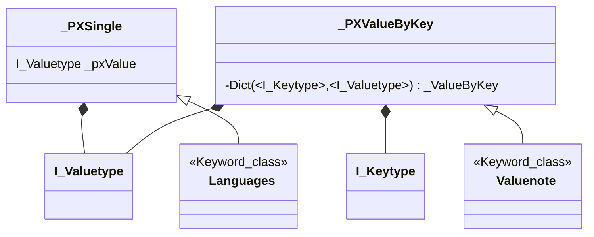

## Pxtool
Not everything here is true :-) but it illustrates how to think about the classes. 
There is about 80 Keywords.
There is one class responsible for the line(s) of each Keyword.
The PxFileModel has one of each of the "keyword"-classes

  

The logical lines/records in a pxfile have the form:

Keypart =  Valuepart ;

The keypart consist of 
- a Keyword 
- an optional 2 letter language code in [] (it may be quoted) 
- an optional "subcube pointer" which is one or more quoted strings separated by commas surounded by ()

like 
- AXIS-VERSION= ...
- NOTE\["en"\]= ...
- CODES\["en"\]("Year")= ...

The Keyword determins if language and subcube-pointer is allowed(/is needed/makes sence) Some keyparts may occur more than once, others may only occur once.
This also depends on the keyword.

So, the lines/keywords may be spilt in 2 groups: Those which "can be identifyed by just the Keyword, and the Others. 
To hold the other-than-keyword information a group of classes has been made. They start their name with Keytype.

The Valuepart also have different types like int and list of strings.

The "classes" I_Keytype and I_Valuetype exists only on a conceptual level. "Mutli" indicate that the Keypart may occur more than once (footnotes)  

The "Keyword-classes" use 2 different superclasses, one \_PxSingle for those that have just the keyword and a value and \_PxValueByKey for the Others. 

      
