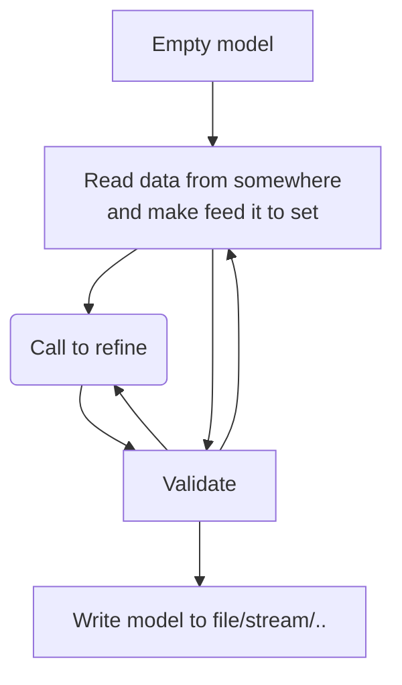

## Pxtool

#Validation
"keyword is present": The model contains at least one occurence of the keyword.
"has value" : has a value for a given key. (For singletons like AXIS-VERSION this is the same as is present) 

"Complete key-set": 
Mandatory keywords must have value=record for each key-part, for example, there must be a list of VALUES for each combination of language and variable. 
Some optional keywords (like CODES) must have a Complete key-set if present, others like footnotes may occur for a specific variable and only in one language (?).

"language-complete": Any subkey found in one language, must be present in all languages(=LANGUAGES).(the strings in the subkey will not be the same, "age" vs "age in swedish.")

if CONTVARIABLE is present :
   VALUES of the CONTVARIABLE is a subkey for all "info-on-measurement"-KEYWORDS (UNITS,,CFPRICES)
   Must all values be present if one is for a given keyword?
      
   if  CONTVARIABLE is not present, none of them take a subkey 
   
For keywords that take variable as a subkey all values from STUB and HEADING must be present as a subkey.

"Illegal keys":
Unlisted language, variable. value

Key-part stuff, should be called in sequence.  It makes little sence to try b if a failed
- a) ensure LANGUAGES and LANGUAGE is present, and than LANGUAGE one LANGUAGES  (  2) check_language: ensures default languge is defined in languages keyword )
- b) ensure at least one of STUB or HEADING is present and when present, is complete and have the same length for all LANGUAGES.
- c) if CONTVARIABLE is present: ensure the value has the same index in STUB union HEADING for all LANGUAGES.
- d) ensure VALUES is complete
- e) check_lang_keys: ensures for keywords in const.LANGDEPENDENT_KEYWORDS that any language used is fould in LANGUAGES
- g) ensure all subkeys are legal
- f) ensure mandatory and completeness   
- f1) check_mandatory: ensures that each mandatory keywords has at least one record in the model.
- f2) completeness:

Pure value, in random order. If one fails this does not affect the succes/failing of others
- check_codes_values_equal_count: ensures that if language and variable are defined for both CODES and VALUES, then they have the same number of values.
- check_decimals: ensures that the value for DECIMALS is lower than or equal to 6 if SHOWDECIMALS is not defined
- check_showdecimals: ensures that if SHOWDECIMALS is present its value is greater than value for DECIMALS

   
  
